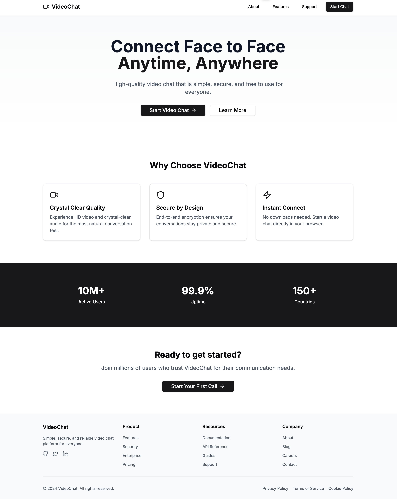

# VideoChat Application

A real-time video chat application built with Next.js, Go, and WebRTC.



## Features

- Real-time video/audio communication
- Toggle camera/microphone
- Connection status indicators
- Responsive design
- Auto cleanup on navigation/tab close

## Tech Stack

- Frontend: Next.js 15, TypeScript, Tailwind CSS, shadcn/ui
- Backend: Go 1.21+
- WebRTC for peer-to-peer communication
- WebSocket for signaling

## Prerequisites

```bash
go 1.23+
node 18+
npm 9+
```

## Installation

1. Clone repository:

```bash
git clone https://github.com/yourusername/videochat.git
cd videochat
```

2. Install frontend dependencies:

```bash
cd frontend
npm install
```

3. Create `.env.local`:

```bash
NEXT_PUBLIC_WS_URL=ws://localhost:8080/ws
```

4. Install Go dependencies:

```bash
cd backend
go mod init videochat
go get github.com/gorilla/websocket
```

## Running the Application

1. Start backend server:

```bash
cd backend
go run main.go
```

2. Start frontend development server:

```bash
cd frontend
npm run dev
```

3. Access application at `http://localhost:3000`

## Project Structure

```
├── frontend/
│   ├── app/
│   │   ├── page.tsx
│   │   ├── layout.tsx
│   │   └── chat/
│   │   └── about/
│   ├── components/
│   │   └── VideoChat.tsx
│   │   └── layout
│   │   └── ui
│   ├── hooks/
│   │   └── useVideoChat.ts
│   └── types/
│       └── video-chat.ts
└── backend/
    ├── main.go
    ├── go.sum
    ├── go.mod
```

## API Endpoints

- `/ws` - WebSocket endpoint for signaling
- `/` - Main application page
- `/chat` - Video chat interface

## Contributing

1. Fork repository
2. Create feature branch: `git checkout -b feature/name`
3. Commit changes: `git commit -m 'Add feature'`
4. Push branch: `git push origin feature/name`
5. Submit pull request

## License

MIT License - see LICENSE file for details

## Contact

Your Name - shilov6865@gmail.com
